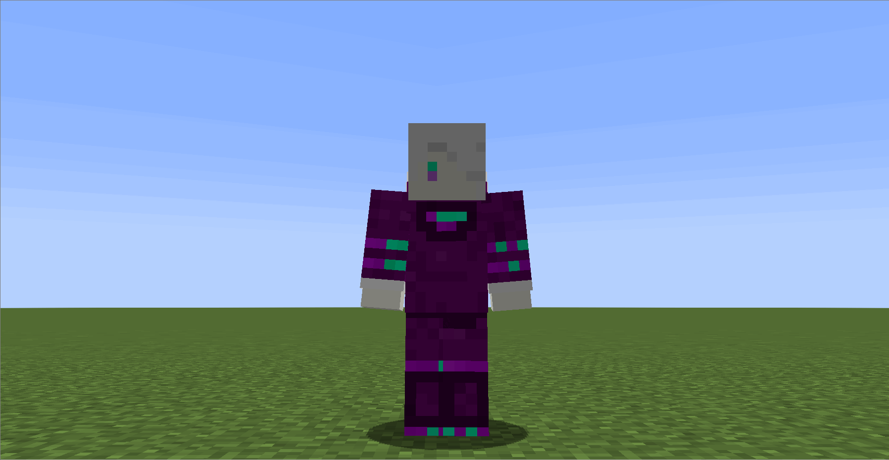
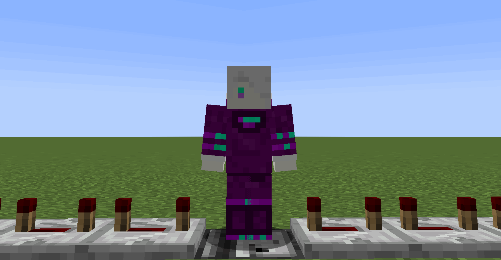

# SneakHeads

A Bukkit/Spigot/Paper plugin + resourcepack combo which lets you "become your head" when you sneak (crouch). Heavily inspired by the "Temple of the Elements" minigame from Twitch Rivals.

Compatible with Minecraft 1.18 - 1.18.2

## Mechanics

Crouching transforms you into your head:

Transforming counts as a solid block:

## Installation

- Install the resourcepack `SneakHeadsPack.zip` (download it and place it in your resourcepacks folder)
- Download the SneakHeads plugin and place it in your `/plugins` folder